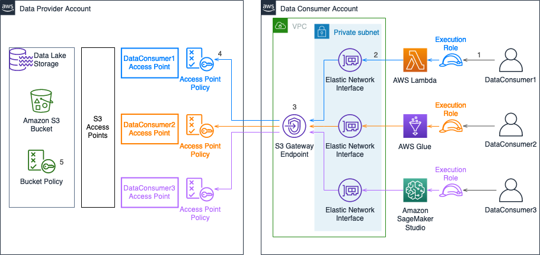
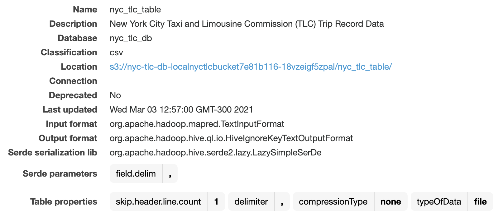
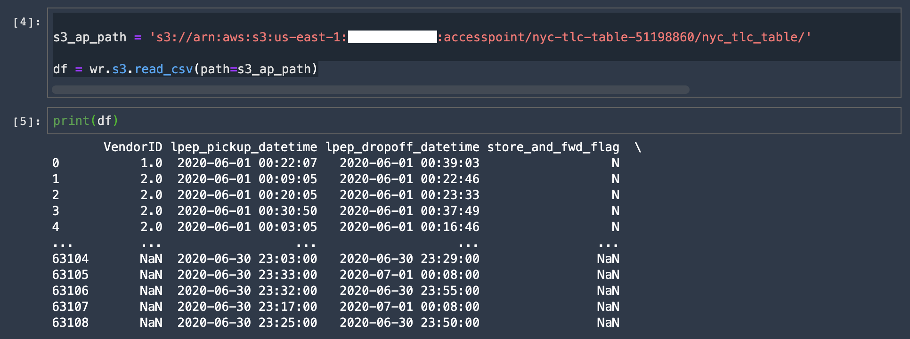

# Compartiendo conjuntos de datos entre cuentas de forma segura usando Amazon S3 Access Points

Muchas organizaciones usan una configuración multicuenta para operar sus data lakes sobre [Amazon S3](https://aws.amazon.com/products/storage/data-lake-storage/). Algunas razones para esta configuración incluyen limitar el radio de impacto en el caso de un problema de seguridad, compartir únicamente tablas que por regulación se pueden compartir y aislar las que no, administrar presupuestos por unidad organizacional o simplificar los gastos de administración (overhead).

[En un artículo anterior](https://aws.amazon.com/es/blogs/aws-spanish/compartiendo-catalogos-de-datos-entre-cuentas-usando-aws-lake-formation/) se describió cómo utilizar [AWS Lake Formation](https://docs.aws.amazon.com/lake-formation/latest/dg/what-is-lake-formation.html) para compartir catálogos de datos desde una cuenta de AWS productora a una cuenta de AWS consumidora, utilizando alguno de los servicios integrados con Lake Formation como Amazon Athena o Amazon Redshift Spectrum. 

Existen escenarios donde una cuenta consumidora de datos requiere acceder de forma directa a los datos subyacentes en Amazon S3, sin utilizar un servicio integrado con Lake Formation. Por ejemplo, cuando un equipo de ingenieros de datos necesita realizar ETLs sobre conjutos de datos de la cuenta productora mediante servicios como [AWS Lambda](https://aws.amazon.com/es/lambda/) o [AWS Glue](https://aws.amazon.com/es/lambda/), o cuando un equipo de científicos de datos requiere cargar directamente conjuntos de datos para análisis exploratorio usando Amazon SageMaker Studio.

Tradicionalmente, estos patrones de acceso requieren mantener una única política de bucket que controla accesos hacia distintas aplicaciones con diferentes niveles de permisos. A medida que la cantidad de aplicaciones crece, se vuelve más complejo administrar y auditar los cambios en esta política. [S3 Access Points](https://aws.amazon.com/es/s3/features/access-points/), o puntos de acceso de S3, son una característica de S3 que simplifica la administración del acceso de datos a escala para aplicaciones que utilizan conjuntos de datos compartidos en S3. Los clientes con conjuntos de datos compartidos pueden escalar fácilmente el acceso para cientos de aplicaciones, creando puntos de acceso individualizados con nombres y permisos personalizados para cada aplicación. Además se puede [restringir un punto de acceso a una Virtual Private Cloud (VPC)](https://aws.amazon.com/blogs/storage/managing-amazon-s3-access-with-vpc-endpoints-and-s3-access-points/), para mantener el acceso a los datos de S3 dentro de las redes privadas de los clientes.

Este artículo describe cómo utilizar S3 Access Points para compartir conjuntos de datos de forma segura entre cuentas de AWS, definiendo políticas individualizadas por cada servicio que requiere acceder a los datos y restringiendo el acceso a los datos de S3 a una VPC en la cuenta consumidora.

## Acceso a conjuntos de datos desde otra cuenta: Cómo funciona

Además de permitir acceso a recursos para usuarios y roles dentro de una misma cuenta, S3 Access Points permite dar acceso a identidades en otras cuentas de AWS, debido al uso de políticas de acceso basadas en [AWS Identity and Access Management ](https://docs.aws.amazon.com/es_es/IAM/latest/UserGuide/introduction.html)(AWS IAM). 

Consideremos el caso de una cuenta **Provider** que mantiene conjuntos de datos que requieren ser consultados por uno o más usuarios de otra cuenta **Consumer** por medio de un servicio consumidor. El siguiente diagrama describe, a alto nivel, el proceso para que un usuario **DataConsumer** de la cuenta **Consumer** pueda descargar un conjunto de datos almacenado en un repositorio de la cuenta **Provider**:

1. El usuario accede al servicio consumidor asumiendo el rol de ejecución asociado al servicio. Este rol cuenta con permisos de acceso al punto de acceso en la cuenta **Provider**.
2. Cada servicio consumidor está configurado para conectarse a una o más subredes privada dentro de una VPC de la cuenta **Consumer**. Para esto, el servicio crea una Elastic Network Interface dentro de cada subred, que se vincula al servicio consumidor. Algunos servicios que permiten conectarse a subredes dentro de una VPC incluyen [Lambda](https://docs.aws.amazon.com/es_es/lambda/latest/dg/configuration-vpc.html), [Glue](https://docs.aws.amazon.com/glue/latest/dg/connection-using.html) (mediante una conexión de tipo *Network*) y [SageMaker Studio](https://docs.aws.amazon.com/es_es/sagemaker/latest/dg/studio-notebooks-and-internet-access.html).
3. Dentro de la VPC, el Gateway Endpoint de S3 permite acceder al endpoint de S3 asociado al access point de forma privada, sin abandonar la red de AWS, evitando la creación de Internet Gateways o NAT Gateways para acceder al endpoint desde subredes privadas.
4. En la cuenta **Provider**, la política asociada al punto de acceso de S3 permite controlar el acceso a los datos en base al rol de ejecución utilizado por cada servicio, la VPC donde se conecta el servicio consumidor, y la ubicación (prefijo) del conjunto de datos dentro del punto de acceso.
   - Opcionalmente, es posible definir políticas de acceso basadas en atributos ([ABAC](https://docs.aws.amazon.com/es_es/IAM/latest/UserGuide/introduction_attribute-based-access-control.html)) para definir permisos de acceso. Para más información, consulte el artículo [How to scale your authorization needs by using attribute-based access control with S3](https://aws.amazon.com/blogs/security/how-to-scale-authorization-needs-using-attribute-based-access-control-with-s3/). 
5. La política de bucket de S3 permite delegar los permisos de acceso a cada política de punto de acceso, cuando los datos son accedidos a través de un endpoint de S3 Access Point.

En la arquitectura anterior, el servicio consumidor puede acceder de forma programática al conjunto de datos que le ha sido compartido. Por ejemplo, la librería para Python [AWS Data Wrangler](https://github.com/awslabs/aws-data-wrangler) provee una API de alto nivel para acceder a conjuntos de datos almacenados en S3 en formato CSV, JSON, Parquet, FWF o Excel, ya sea mediante el endpoint del bucket o mediante un punto de acceso, e importarlos como un DataFrame de Pandas. La [documentación](https://aws-data-wrangler.readthedocs.io/en/2.4.0-docs/install.html) de AWS Data Wrangler contiene instrucciones para instalar la librería dependiendo del servicio consumidor a utilizar. 

Además de acceder directamente al conjunto de datos, al utilizar puntos de acceso es posible agregar su propio código para procesar estos datos antes de entregárselos a la aplicación, mediante la característica [S3 Object Lambda](https://aws.amazon.com/es/s3/features/object-lambda/). Esto permite implementar casos de uso tales como ofuscación de información personal (PII) o enriquecimiento de datos con información de otras fuentes. Si bien en el presente artículo no se utiliza S3 Object Lambda, el artículo [Introducing Amazon S3 Object Lambda – Use Your Code to Process Data as It Is Being Retrieved from S3](https://aws.amazon.com/blogs/aws/introducing-amazon-s3-object-lambda-use-your-code-to-process-data-as-it-is-being-retrieved-from-s3/) ejemplifica cómo implementar esta característica.

## Paso a paso

En este paso a paso demostraremos cómo brindar acceso a los datos a un rol en una cuenta AWS diferente, siguiendo el flujo descrito en la sección anterior. Para esto realizaremos las siguientes tareas:

### En la cuenta Provider:

- Identificar la ubicación del conjunto de datos en el catálogo de AWS Glue.
- Crear un S3 Access Point asociado al bucket que almacena el conjunto de datos. 
- Configurar el bucket policy de S3 para permitir accesos desde S3 Access Point.

### En la cuenta Consumer:
- Validar el acceso al conjunto de datos desde un servicio consumidor.

### Prerrequisitos

Para seguir este paso a paso, se debería contar con lo siguiente:

- Dos cuentas AWS (**Provider** y **Consumer**).
- Conocimiento básico sobre políticas y roles de AWS IAM.
- En la cuenta **Consumer**:
  - Una VPC con un Gateway Endpoint para S3. Para más información sobre cómo configurar un Gateway Endpoint para S3 y utilizarlo para S3 Access Point, consulte el artículo [Managing Amazon S3 access with VPC endpoints and S3 Access Points](https://aws.amazon.com/blogs/storage/managing-amazon-s3-access-with-vpc-endpoints-and-s3-access-points/).
  - Un servicio consumidor del conjunto de datos (Lambda, Glue, SageMaker Studio, etc.), conectado a una subred privada en la VPC con el Gateway Endpoint para S3.
  - Un rol de IAM asociado al servicio consumidor, con permisos de acceso a S3.
- En la cuenta **Provider**:
  - Un conjunto de datos almacenado en S3 y registrado en el catálogo de AWS Glue. El artículo [Compartiendo catálogos de datos entre cuentas usando AWS Lake Formation](https://aws.amazon.com/es/blogs/aws-spanish/compartiendo-catalogos-de-datos-entre-cuentas-usando-aws-lake-formation/) incluye una plantilla de AWS CloudFormation que permite automatizar la creación y registro de un conjunto de datos de ejemplo.
- Validar que los servicios se encuentren desplegados en la misma región en ambas cuentas.

## Paso 1: Identificando la ubicación del conjunto de datos en el catálogo de AWS Glue
En nuestro ejemplo, contamos con el conjunto de datos [New York City Taxi and Limousine Commission (TLC) Trip Record Data](https://registry.opendata.aws/nyc-tlc-trip-records-pds/) almacenado en un bucket de S3 de la cuenta **Provider** y registrado con Glue. Para identificar su ubicación realizamos los siguientes pasos:

1. Desde la consola de Glue, bajo **Data Catalog**, seleccionamos **Tables**.
2. En el panel de **Tables**, seleccionamos la tabla asociada al conjunto de datos que deseamos compartir para visualizar sus propiedades.
3. En el panel de propiedades de la tabla, extraemos la información del campo **Location**, que será utilizada en pasos posteriores para crear el S3 Access Point. Este campo corresponde a un URI de S3, con el formato <code>s3://<em>&lt;bucket&gt;</em>/<em>&lt;prefix&gt;</em></code>. 

.

## Paso 2: Creación de un S3 Access Point asociado al bucket que almacena el conjunto de datos.

1. Desde la consola de S3, seleccionamos el bucket donde se ubica el conjunto de datos, según la información obtenida en el paso anterior. Luego [creamos un access point asociado al bucket](https://docs.aws.amazon.com/AmazonS3/latest/userguide/create-access-points.html). 
   - En **Access point name**, indicamos un nombre para el access point. Para este ejemplo usaremos `nyc-tlc-table-51198860`.
   - En **Network origin**, seleccionamos **Virtual private cloud (VPC)**.
   - En **VPC ID**, ingresamos el ID de la VPC a la que está asociada el servicio consumidor en la cuenta **Consumer**.
   - Bajo **Block Public Access settings for this access point** seleccionamos **Block all public access**.
   - Para **Access point policy** usamos el siguiente documento de política JSON, reemplazando el [ARN del access point](https://docs.aws.amazon.com/AmazonS3/latest/userguide/using-access-points.html), el [ARN del rol de IAM](https://docs.aws.amazon.com/IAM/latest/UserGuide/reference_identifiers.html#identifiers-arns) asociado al servicio consumidor (Lambda, Glue, SageMaker Studio, etc.), y el prefijo asociado al conjunto de datos (obtenido en el Paso 1):

		<pre class=" language-json">
		{
			"Version": "2012-10-17",
			"Statement": [
				{
					"Effect": "Allow",
					"Principal": {
						"AWS": "<em>&lt;consumer role arn&gt;</em>"
					},
					"Action": "s3:*GetObject*",
					"Resource": "<em>&lt;access point arn&gt;</em>/object/<em>&lt;prefix&gt;</em>*"
				},
				{
					"Effect": "Allow",
					"Principal": {
						"AWS": "<em>&lt;consumer role arn&gt;</em>"
					},
					"Action": "s3:ListBucket",
					"Resource": "<em>&lt;access point arn&gt;</em>",
					"Condition": {
						"StringLike": {
							"s3:prefix": [
								"<em>&lt;prefix&gt;</em>"
							]
						}
					}
				}
			]
		}
		</pre>

Esta política permite acceso de lectura al access point de S3 sólo al rol de IAM asociado al servicio consumidor, y sólo en la ubicación donde se almacena el conjunto de datos.

Para detalles y consideraciones adicionales respecto a la configuración de access points con origen desde una VPC, consulte el artículo [Managing Amazon S3 access with VPC endpoints and S3 Access Points](https://aws.amazon.com/blogs/storage/managing-amazon-s3-access-with-vpc-endpoints-and-s3-access-points/).

## Paso 3: Configurando el bucket policy de S3 para permitir accesos desde S3 Access Point.

Para que el servicio consumidor tenga acceso al bucket mediante el access point creado en el paso anterior, debemos delegar la autorización de acceso del bucket al access point.

1. Desde la consola de S3, seleccionamos el bucket donde se ubica el conjunto de datos. Luego [creamos o editamos la política de bucket](https://docs.aws.amazon.com/es_es/AmazonS3/latest/userguide/add-bucket-policy.html).
   - Para **Bucket policy** usamos el siguiente documento de política JSON, reemplazando el ID de la cuenta **Producer**, y el nombre del bucket asociado al conjunto de datos. En caso de existir un bucket policy, sólo agregamos el *statement* incluido dentro de este documento: 

		<pre class=" language-json">
		{
			"Version": "2012-10-17",
			"Statement": [
				{
					"Effect": "Allow",
					"Principal": {
						"AWS": "*"
					},
					"Action": "*",
					"Resource": [
						"arn:aws:s3:::<em>&lt;bucket&gt;</em>",
						"arn:aws:s3:::<em>&lt;bucket&gt;</em>/*"
					],
					"Condition": {
						"StringEquals": {
							"s3:DataAccessPointAccount": "<em>&lt;producer account id&gt;</em>"
						}
					}
				}
			]
		}
		</pre>

Esta política delega el control de acceso al bucket a través de access points a las políticas configuradas en cada access point, siempre que sea un access point definido dentro de la misma cuenta AWS del bucket. Opcionalmente, es posible utilizar [otras *Condition Keys*](https://docs.aws.amazon.com/es_es/AmazonS3/latest/userguide/access-points-policies.html#access-points-condition-keys) que limiten la delegación de control de acceso a un access point y/u origen específicos. 

## Paso 4: Validando el acceso al conjunto de datos desde un servicio consumidor.

Ejecutaremos un notebook Jupyter en SageMaker Studio para demostrar cómo un servicio en la cuenta **Consumer** puede acceder al conjunto de datos en la cuenta **Provider** por medio de un punto de acceso de S3. Usaremos la librería [AWS Data Wrangler](https://github.com/awslabs/aws-data-wrangler) para leer el conjunto de datos [en formato CSV](https://aws-data-wrangler.readthedocs.io/en/2.4.0-docs/stubs/awswrangler.s3.read_csv.html#awswrangler.s3.read_csv) e importarlo como un DataFrame de Pandas. En el path de S3, usaremos el ARN del access point en vez del nombre del bucket.

1. En caso de no contar con un entorno de SageMaker Studio asociado a una VPC de la cuenta Consumer, creamos un nuevo dominio de Studio. El artículo [Securing Amazon SageMaker Studio connectivity using a private VPC](https://aws.amazon.com/blogs/machine-learning/securing-amazon-sagemaker-studio-connectivity-using-a-private-vpc/) detalla los pasos necesarios para esta configuración. 
   
2. [Agregamos un nuevo *user profile*](https://docs.aws.amazon.com/sagemaker/latest/dg/onboard-iam.html) al dominio de Studio, y le asignamos el rol de ejecución que utilizamos en el documento de política de acceso en el Paso 2.
   - El rol de ejecución deberá contar con permisos de acceso a S3. En particular, las políticas administradas `AmazonS3ReadOnlyAccess` y `AmazonS3FullAccess` permiten acceso de sólo lectura y de lectura/escritura a S3, respectivamente.
   - Si sólo deseamos asignar permisos de lectura sobre la ubicación del conjunto de datos por medio del punto de acceso, deberemos [modificar una de las políticas de permisos](https://docs.aws.amazon.com/es_es/IAM/latest/UserGuide/roles-managingrole-editing-console.html#roles-modify_permissions-policy) del rol de ejecución para incorporar los siguientes *statements*, reemplazando el [ARN del access point](https://docs.aws.amazon.com/AmazonS3/latest/userguide/using-access-points.html) y el prefijo asociado al conjunto de datos (obtenido en el Paso 1):

		<pre class=" language-json">
		{
			"Effect": "Allow",
			"Action": "s3:*GetObject*",
			"Resource": "<em>&lt;access point arn&gt;</em>/object/<em>&lt;prefix&gt;</em>*"
		},
		{
			"Effect": "Allow",
			"Action": "s3:ListBucket",
			"Resource": "<em>&lt;access point arn&gt;</em>",
			"Condition": {
				"StringLike": {
					"s3:prefix": [
						"<em>&lt;prefix&gt;</em>"
					]
				}
			}
		}
		</pre>
  
3. Ingresamos a Studio con el *user profile* creado. 
4. Dentro de Studio, [clonamos el repositorio](https://docs.aws.amazon.com/sagemaker/latest/dg/studio-tasks-git.html) asociado a este paso a paso.
	- Ingresamos la URI  `https://github.com/aws-samples/amazon-s3-access-point-cross-account.git`
5. En el panel de la izquierda, en **File Browser**, abrimos la carpeta `lakeformation-crossaccount`, luego la carpeta `notebook` y escogemos el notebook `sagemaker-s3-access-point.ipynb`.
6. En el cuadro de diálogo **Select Kernel**, escogemos **Python 3 (Data Science)**, y esperamos que se inicialice el kernel.
7. En el notebook, asignamos a las variables `S3_ACCESS_POINT_ARN` y `TABLE_PREFIX` el ARN del punto de acceso creado y el prefijo asociado a la tabla (obtenido en el Paso 1), respectivamente. 
8. Ejecutamos el código del notebook para validar que conseguimos acceder al conjunto de datos en la cuenta **Producer** e importarlo como un DataFrame de Pandas en la cuenta **Consumer**, por medio de un punto de acceso de S3 y de forma privada, sin salir de la red de AWS.

  

## Limpieza
Para evitar cargos futuros y/o mantener recursos sin utilización, se deben eliminar los recursos creados durante este paso a paso, en caso de no requerirlos.

**En la cuenta Consumer:**
  - Eliminar la instancia del servicio consumidor utilizado.
  - Eliminar la ENI asociada al recurso consumidor.
  - Eliminar el Gateway Endpoint de S3.

**En la cuenta Provider:**
  - Eliminar el punto de acceso creado.
  - Eliminar el conjunto de datos creado en S3.

## Conclusión
En este artículo se describió cómo utilizar S3 Access Points para compartir conjuntos de datos de forma segura entre cuentas de AWS, definiendo políticas individualizadas por cada servicio que requiere acceder a los datos y restringiendo el acceso a los datos de S3 a una VPC en la cuenta consumidora.

La arquitectura presentada permite complementar la estrategia de accesos a catálogos compartidos mediante Lake Formation, en escenarios donde se requiere acceso directo a los datos subyacentes en S3.

Los invitamos a probar esta arquitectura de referencia siguiendo el paso a paso. También pueden utilizar el template de CloudFormation para facilitar la creación de un punto de acceso hacia un conjunto de datos en la cuenta productora.

Al desplegar el template de CloudFormation, se deberá proveer la siguiente información:
- Indicar si se está usando Lake Formation para administrar los permisos de acceso al catálogo. En tal caso, el stack deberá desplegarse usando un rol de IAM que tenga permisos de [administrador de Lake Formation](https://docs.aws.amazon.com/lake-formation/latest/dg/how-it-works.html#terminology-admin).
- Nombre de la Database de Glue a la cual pertenece la Tabla.
- Nombre de la Tabla asociada al conjunto de datos.
- ARN del rol de IAM en la cuenta consumidora al que se le dará acceso al conjunto de datos.
- VPC que será usada por el servicio consumidor para acceder al conjunto de datos.

Por último, los invitamos a probar esta arquitectura en conjunto con la característica [S3 Object Lambda](https://aws.amazon.com/es/s3/features/object-lambda/), para casos de uso que requieran procesar datos antes de entregárselos a una aplicación o servicio consumidor.

## Security

See [CONTRIBUTING](CONTRIBUTING.md#security-issue-notifications) for more information.

## License

This library is licensed under the MIT-0 License. See the LICENSE file.
